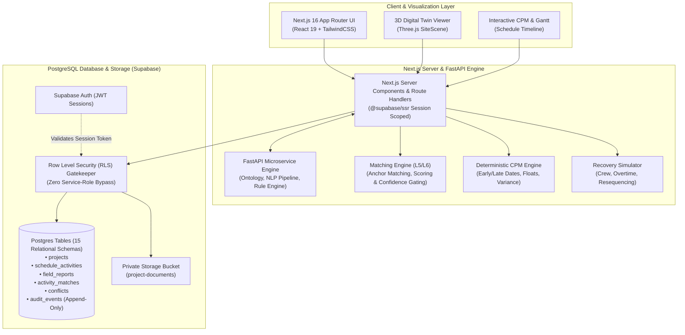

# 🏗️ Plan2Reality (P2R) — Trusted Execution Intelligence
### *AI-Powered Field Intelligence, L5/L6 Activity Matching & Critical Path Recovery for Mega EPC Projects*

[](https://nextjs.org/)
[](https://react.dev/)
[](https://fastapi.tiangolo.com/)
[](https://supabase.com/)
[](https://www.typescriptlang.org/)
[](https://python.org)
[](https://threejs.org/)
[](https://supabase.com/docs/guides/database/postgres/row-level-security)

---

## 📌 Executive Summary

Modern mega-infrastructure and industrial EPC (Engineering, Procurement, Construction) projects face massive cost overruns and multi-month delays due to **the reality gap**: the disconnect between unstructured daily field progress (Daily Progress Reports - DPRs, supervisor notes, chat updates) and rigid master project schedules (Primavera P6, MS Project, L5/L6 WBS).

**Plan2Reality (P2R)** bridges this divide with an enterprise-grade AI execution engine that:
1. **Ingests & Dissects Unstructured DPRs**: Extracts tags, disciplines, equipment IDs, locations, and progress percentages via LLMs and deterministic fallback extractors.
2. **Deterministic L5/L6 Entity Matching**: Matches extracted site progress against thousands of granular schedule activities using engineering tag anchors, contextual discipline weights, and confidence gating.
3. **Automated CPM Recalculation**: Propagates schedule slippage downstream along the Critical Path in real-time.
4. **Scenario Recovery Simulator**: Models mitigation strategies (*Add Extra Shift, Expand Crew, Resequence Predecessors*) with cost-benefit analysis.
5. **3D Digital Twin Site Scene**: Visualizes spatial progress in an interactive 3D site model.
6. **Zero-Trust Enterprise Governance**: Built on Supabase PostgreSQL with strict **Row Level Security (RLS)** on every table, role-based access control (RBAC), and an immutable cryptographic audit ledger.

---

## 🏛️ System Architecture



---

## 🚀 Key Functional Modules

| Module | Description | Core Capabilities |
|---|---|---|
| 📝 **Field Updates & Extraction** | DPR Text & Document Parser | Ingests raw supervisor text/files, extracts progress, units, equipment tags (`PIP-R3-2401`), and disciplines. |
| 🎯 **L5/L6 Matching & Review Queue** | Algorithmic Entity Linking | Scores candidates via lexical token overlap, discipline filtering, and tag anchors with confidence categories (`HIGH`, `MEDIUM`, `LOW`, `UNMATCHED`). |
| ⚡ **Conflict Center** | Anomaly & Integrity Detection | Flags negative progress regressions, out-of-sequence completions, and concurrent duplicate reporting. |
| 📊 **CPM & Schedule Impact** | Critical Path Analyzer | Quantifies variance vs baseline, recalculates successor start/finish dates, and highlights critical activities. |
| 🛠️ **Recovery Simulator** | What-If Delay Mitigation | Simulates `Add Crew (+50% rate)`, `Extra Shift (+100% rate)`, and `Resequence Fast-Track` to recover slippage. |
| 🏗️ **3D Site Digital Twin** | Spatial Progress Visualization | Interactive Three.js BIM/site layout displaying real-time activity completion by spatial rack/area. |
| 📜 **Execution Memory** | Knowledge Base & Precedents | Searchable historical log of root causes, delay mitigation notes, and engineering lessons learned. |
| 🛡️ **Immutable Audit Trail** | Cryptographic Ledger | Insert-only database table tracking every decision, approval, modification, and user action. |

---

## 🔒 Enterprise Security & Row Level Security (RLS)

Plan2Reality strictly rejects server-side service-role bypass keys. Every server component, API endpoint, and database call is evaluated **in the context of the authenticated user's JWT** via `@supabase/ssr`.

### RBAC Permission Matrix

| Role | Schedule Read | DPR Submission | Review & Approval | Conflict Resolution | Admin Config |
|:---|:---:|:---:|:---:|:---:|:---:|
| **ADMIN** | ✅ | ✅ | ✅ | ✅ | ✅ |
| **PROJECT_MANAGER** | ✅ | ✅ | ✅ | ✅ | ❌ |
| **PLANNER** | ✅ | ✅ | ✅ | ✅ | ❌ |
| **SUPERVISOR** | ✅ | ✅ | ❌ | ❌ | ❌ |
| **VIEWER** | ✅ | ❌ | ❌ | ❌ | ❌ |

> 🛡️ **Database-Enforced Integrity**:
> - `audit_events` table is **INSERT-ONLY** (no `UPDATE` or `DELETE` policy exists in Postgres).
> - Helper functions `is_project_member()` and `current_role_name()` are `SECURITY DEFINER` with public execution privileges stripped.

---

## 🛠️ Tech Stack & Directory Structure

### Technology Stack
- **Frontend**: Next.js 16 (App Router), React 19, TypeScript, Tailwind CSS, Lucide Icons
- **3D Graphics**: Three.js, React Three Fiber / WebGL Canvas
- **Backend / API**: Next.js Server Actions & Route Handlers, Python FastAPI microservice
- **Database & Auth**: PostgreSQL 15+, Supabase Auth, Row Level Security, Supabase Storage
- **Testing & Tooling**: Vitest, Pytest, ESLint

### Repository Structure
```plaintext
SIH-2026/
├── app/                          # Next.js App Router (Pages & API Routes)
│   ├── activities/               # L5/L6 Schedule Activity Explorer
│   ├── analytics/                # KPI Dashboard & Velocity Metrics
│   ├── audit/                    # Immutable Security Audit Trail
│   ├── conflicts/                # Conflict Center & Anomaly Detection
│   ├── critical-path/            # Critical Path Network Analysis
│   ├── dashboard/                # Executive Overview
│   ├── documents/                # Secure Project Storage Explorer
│   ├── execution-memory/         # Searchable Historical Precedents
│   ├── field-updates/            # DPR Submission & AI Extraction Form
│   ├── recovery/                 # Delay Recovery Scenario Simulator
│   ├── review/                   # Planner Match Verification Queue
│   ├── schedule/                 # Master Gantt Schedule View
│   ├── site-3d/                  # 3D Digital Twin Scene Viewer
│   └── api/                      # Authenticated Route Handlers
├── backend/                      # Python FastAPI Intelligent Backend
│   ├── app/
│   │   ├── agents.py             # Multi-Agent Extraction & Reasoning
│   │   ├── ontology.py           # Construction Domain Hierarchy
│   │   ├── parsers.py            # OCR & Document Extraction
│   │   ├── pipeline.py           # DPR Ingestion Pipeline
│   │   └── rules.py              # Anomaly & Logic Verification Rules
│   └── tests/                    # Pytest Pipeline Verification Suite
├── components/                   # Reusable UI & 3D Components
│   ├── 3d/SiteScene.tsx          # Three.js Digital Twin Engine
│   ├── Shell.tsx                 # Application Layout & Navigation
│   └── shell/                    # Command Palette, Notifications
├── lib/                          # Core Algorithmic Engines & Utils
│   ├── engine/
│   │   ├── cpm.ts                # Critical Path Method Computation
│   │   ├── matching.ts           # Activity Entity Matcher
│   │   └── extraction.ts         # Multi-Tier NLP Extractor
│   └── supabase/                 # Authenticated SSR Client Factories
├── supabase/                     # Database Migrations & Seed Data
│   ├── migrations/               # Production SQL & RLS Policies
│   └── seed.sql                  # Multi-Role Demo Data Seed
└── public/                       # Static Assets & Icons
```

---

## ⚡ Quick Start & Local Setup

### 1. Prerequisites
- **Node.js**: `v20.x` or higher
- **Python**: `3.11` or higher
- **Supabase Account / Local Instance**

### 2. Clone & Install Dependencies
```bash
# Clone the repository
git clone https://github.com/dakshverma-dev/SIH-2026.git
cd SIH-2026

# Install Node dependencies
npm install

# (Optional) Setup Python virtual environment for FastAPI backend
cd backend
python -m venv .venv
source .venv/bin/activate  # On Windows: .venv\Scripts\activate
pip install -r requirements.txt
cd ..
```

### 3. Configure Environment Variables
Copy `.env.example` to `.env`:
```bash
cp .env.example .env
```

Set your configuration in `.env`:
```env
NEXT_PUBLIC_SUPABASE_URL=https://<your-project-id>.supabase.co
NEXT_PUBLIC_SUPABASE_ANON_KEY=<your-anon-publishable-key>

# Optional: Real LLM extraction (defaults to deterministic DEMO_FALLBACK if empty)
ANTHROPIC_API_KEY=your_anthropic_api_key_here
```

### 4. Database Setup & Migrations
1. In your Supabase project SQL Editor, run the migration files located in `supabase/migrations/` in chronological order.
2. Execute `supabase/seed.sql` to populate sample EPC projects, L5/L6 activities, predecessors, and test accounts.

### 5. Run the Application
```bash
npm run dev
```
Open **[http://localhost:3000](http://localhost:3000)** in your browser.

---

## 👥 Demo Credentials

The login screen provides one-click autofill for quick role-switching:

| Account Role | Email Address | Password | Permissions Summary |
|---|---|---|---|
| **Admin** | `admin@plan2reality.io` | `admin123` | Full administrative control & access |
| **Project Manager** | `pm@plan2reality.io` | `pm12345` | Global review, recovery, & schedule oversight |
| **Planner** | `planner@plan2reality.io` | `plan123` | Match approval, CPM adjustments & impacts |
| **Site Supervisor**| `supervisor@plan2reality.io` | `sup1234` | DPR creation, document upload |
| **Auditor / Viewer**| `viewer@plan2reality.io` | `view123` | Read-only analytics & timeline view |

---

## 🧪 Testing & Verification

```bash
# Run unit & engine tests
npm run test

# Run production build validation
npm run build
```

---

## 🏆 SIH 2026 Problem Statement Alignment

- **Problem Statement**: AI-Driven Construction & Infrastructure Schedule Intelligence & Reality-Matching
- **Target Impact**: Elimination of manual DPR reconciliation delays, proactive bottleneck mitigation, and provable transparency across EPC stakeholders.

---

<div align="center">
  <sub>Developed with ❤️ for Smart India Hackathon 2026.</sub>
</div>
